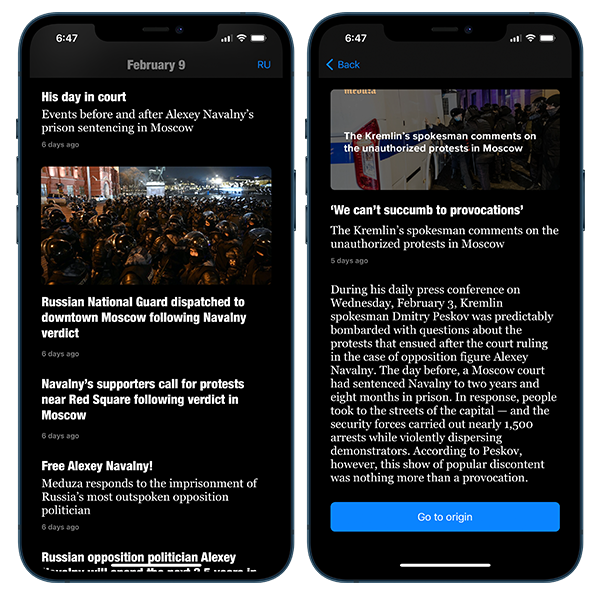
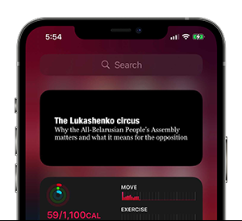

# News Feed App (iOS)

This application was done just out of curiosity. API was taken from [meduza.io](http://meduza.io).

## Task

Write an app that fetches data from the web and displays data in a list. As a minimum list items should contain an image and a title. On tapping the item from the list it should open a new screen displaying further details. You can use any API you prefer for fetching the data.

## Description

I took a challenge and made this task a bit more complicated:

1. Without Storyboard
2. Cell with dynamic height size
3. Prefetching and pagination
4. Image caching
6. 2 languages of content with saving states persistently
6. Widgets with latets news (systemMedium and systemSmall)

## Enhancements Todo

1. Get rid of ancors - too much codes.
2. Rebuild architecture (not usable now)
3. Reorganize hard-constants
4. Refactor dependecies in VC and localization